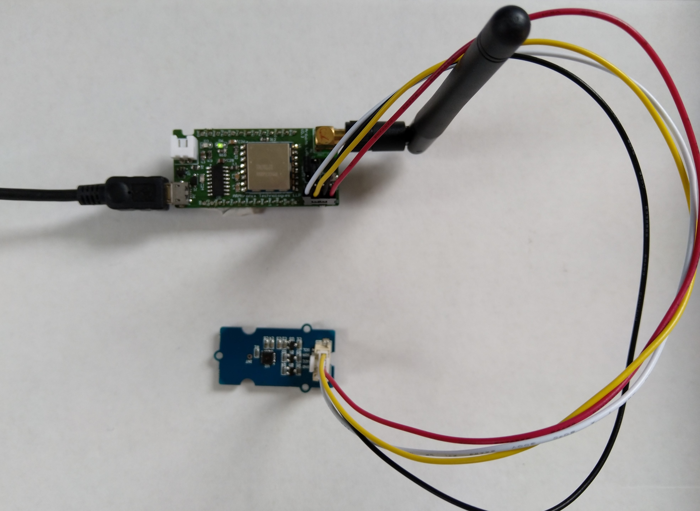

# FieldGateway.LoRa.ArmtronixIA005Client
Sample Armtronix IA005 based client for my Windows 10 IoT Core LoRa field gateways

This is a demo duino client (based on one of the examples from Arduino-LoRa) that uploads telemetry data to my Windows 10 IoT Core on Raspberry PI field gateways. 

Bill of materials (Prices as at Dec 2019) 

Device

* [Armtronix IA005:SX1276 LoRa node STM32F103](https://www.tindie.com/products/Armtronix/ia005-sx1276-lora-node-stm32f103-pair-2nos/) USD36 (USD18 each)

Extras

* [SeeedStudio Grove-Temperature & Humidity Sensor](https://www.seeedstudio.com/Grove-Temperature%26Humidity-Sensor-%28High-Accuracy-%26-Mini%29-p-1921.html) USD11.50

* [SeeedStudio Grove-4 pin Female Jumper to Grove 4 pin Conversion Cable](https://www.seeedstudio.com/Grove-4-pin-Female-Jumper-to-Grove-4-pin-Conversion-Cable-5-PCs-per-PAck.html) USD3.90

For more information see my [blog post](https://blog.devmobile.co.nz/2019/12/18/armtronix-ia005-sx1276-lora-node/) 

